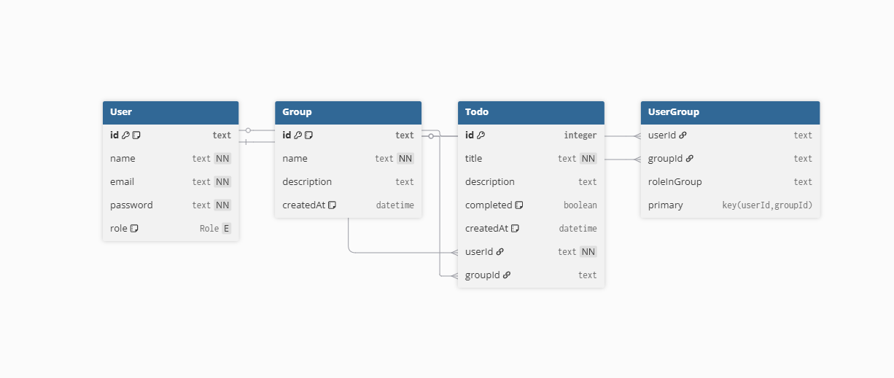

## Bem vindo




# 📝 ProjetoInit – To-Do List (Backend + Frontend)

Projeto de estudo: backend em Node.js (Fastify, Prisma, JWT) e frontend em React + Vite + TypeScript.  
Inclui **criação e exclusão de tarefas**, **autenticação via JWT**, **criação de usuários**, **criação de grupos com novos membros (via e-mail)** e **tarefas compartilhadas entre usuários do grupo**.  

Cada tarefa esta ligada a seu usuario ou ao grupo que o usuario pertence , tarefas em grupo só podem ser deletadas pelo criador da tarefa (temporariamente) , tarefas podem ser marcadas como concluidas ou pendentes e mostradas na estatistica do dashboard

‼️ **ATENÇÃO**  

- email: `desenvolvedor@dev.com`  
- password: `123456`  

Esse perfil é de membro e não tem tasks ativas para você testar e ver como o sistema está funcionando, caso não queira criar um usuario .  

---

## É sua primeira vez com o projeto? 
É extremamente necessario usar o npx prisma generate , o Prisma ORM precisa gerar o arquivo do banco de dados , mesmo gerado é bom sempre autualizar com o mesmo comando. 
O projeto apresenta alguns problemas que estão sendo constantemente atualizados , agradeço pela atenção 

## 📖 Visão Geral

Arquitetura com separação por camadas (**controllers, use-cases, repositories, middlewares**).  
Backend com **Prisma** para persistência (SQLite por padrão) e **repositórios em memória** para testes.  
Frontend em **React + Vite** com **componentes reutilizáveis**.  

 O front end usa rotas protegidas , devido a isso as camadas de context usam providers próprios no main , é uma forma de como o React permite o roteamento 

---

## ⚡ Tecnologias

**Backend**: Node.js, Fastify, Prisma, Zod, TypeScript, JWT  
**Frontend**: React, Vite, TypeScript, Tailwind / CSS custom  
**Testes**: Vitest  

---

## 📂 Estrutura (resumida)

backend/
└── src/ (controllers, routes, use-cases, repositories, middlewares)
└── app.ts (Fastify + CORS + plugins)

frontend/
└── src/ (components, pages, api, hooks, context)
└── vite.config.ts


---

## 🔧 Instalação (Windows)

### 1. Clonar repositório (raiz do projeto)

```bash
git clone <repo> && cd ProjetoInit

2. Backend
```bash

cd backend
npm install
npx prisma generate
# copiar/ajustar .env a partir de .env.example (defina JWT_SECRET)
npm run dev
```
### 3. Frontend
```bash
cd frontend
npm install
# (opcional) configurar .env VITE_API_URL se backend estiver em outra URL
npm run dev
```
Frontend roda em: http://localhost:5173
Backend roda em: http://localhost:3333
---
🔑 Variáveis de ambiente importantes

Backend (.env)
- DATABASE_URL="file:./dev.db" (SQLite por padrão)
- JWT_SECRET="algumasenha" (defina uma senha segura)
- PORT=3333 (porta do backend)

## Como o Frontend integra com o Backend

Autenticação via JWT:
Após login (POST /sessions) o backend retorna token JWT, armazenado no localStorage.

Todas as requisições autenticadas usam:

Authorization: Bearer <token>


## Endpoints usados no frontend:

GET /todo → listar tarefas

POST /todo → criar tarefa (body: { title: "..." })

DELETE /todo/:id → deletar tarefa


## 📡 Endpoints principais (backend)
Usuários & Sessões

POST /users → criar usuário

POST /sessions → login (retorna JWT)

- Grupos

POST /groups → criar grupo com usuários (via e-mail)

GET /groups/:id → listar grupo e seus membros

- Tarefas

GET /todo → listar tarefas do usuário ou grupo

POST /todo → criar tarefa (aparece para todos do grupo)

DELETE /todo/:id → deletar tarefa

PATCH /todo/:id/complete → marcar como concluída

## 🛠 Notas importantes / Troubleshooting

O projeto esta em protótipo então sua arquitetura esta configurada para lidar com 
baixas restrições no CORS
ou seja temporariamente roda melhor em HTTP e não em HTTPS 

CORS → já configurado no backend com @fastify/cors.

Token ausente (401) → verifique o localStorage.

404 em requests → confirme rotas (/todo, /groups, /users).

Proxy Vite → pode ser usado para evitar CORS.

## 🧪 Testes
Alguns testes estão sendo modificados devido a re-estruturação do backend

Backend:

cd backend
npm run test


## ✅ O que foi implementado
Backend

Fastify + Prisma + JWT

CRUD de tarefas

Criação de usuários

Criação de grupos com usuários via e-mail

Tarefas compartilhadas entre membros do grupo

Frontend

React + Vite + TypeScript

Modal para criação de tarefas

Grid responsivo de tasks

Exclusão otimista com refetch em caso de erro

Exibição de tarefas compartilhadas

## 🛠 Próximos Passos

 Melhorar UI do sistema (UX e responsividade)

 Aumentar cobertura de testes nos use-cases

 Implementar update de tarefas

 Implementar dashboard de admin

 Exclusão de grupos

 Listagem de membros


✍️ Projeto em constante evolução – feito para estudos e aprendizado!