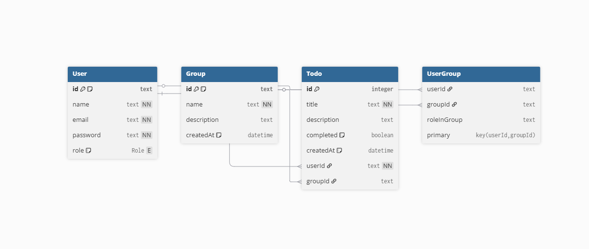

# Init Tasks — Full-Stack Task & Group Management Platform (Backend + Frontend + Mobile)



**Projeto de estudo**: backend em Node.js (Fastify, Prisma, Zod, JWT) + frontend em React + Vite + TypeScript (também app mobile com React Native / Expo).
Funcionalidades principais: autenticação JWT, CRUD de tarefas, grupos (tarefas compartilhadas entre membros), dashboard de estatísticas.

---


## ATENÇÃO
no mobile é necesario criar um arquivo na pasta android chamado local.properties e colar isso
sdk.dir=C:\\Users\\{seu usuario}\\AppData\\Local\\Android\\Sdk
è um bug do emulador 

## 🔎 Visão geral rápida

* **Backend**: Node.js, Fastify, Prisma (SQLite por padrão), Zod, JWT, TypeScript
* **Frontend**: React + Vite + TypeScript (components reutilizáveis)
* **Mobile**: Expo / React Native (integra com o backend)
* **Arquitetura**: controllers → use-cases → repositories → middlewares (limpa separação por responsabilidades)

---

## ✅ Principais features

* Registro e login (JWT).
* Criação/remoção/atualização de tarefas.
* Grupos: criar grupo, adicionar membros por e-mail.
* Tarefas podem pertencer a usuário ou a grupo; visíveis a membros do grupo.
* Dashboard com estatísticas (totais, concluídas, pendentes).
* Frontend com experiência mobile-first; inputs reutilizáveis, modal de criação.

---

## ⚠️ Conta de teste

* **E-mail**: `desenvolvedor@dev.com`
* **Senha**: `123456`
  (Conta de membro — útil para testes sem criar novo usuário.)

---

## 🔧 Pré-requisitos

* Node.js (>=16 recomendado)
* npm ou pnpm
* Git
* Para mobile: Expo CLI (se usar app React Native / Expo)
* Para persistência local: SQLite (não precisa instalar — Prisma cria `dev.db` automaticamente)

---

## 📁 Estrutura (resumida)

```
backend/
  src/
    controllers/
    routes/
    use-cases/
    repositories/
    middlewares/
  prisma/
  package.json

frontend/
  src/
    components/
    pages/
    hooks/
    services/
  vite.config.ts

todo/ (mobile - Expo)
  src/
  app.json / app.config
```

---

## 🛠 Instalação & execução

### 1) Clonar

```bash
git clone <repo-url> ProjetoInit
cd ProjetoInit
```

### 2) Backend

```bash
cd backend
npm install

# gerar client Prisma (obrigatório)
npx prisma generate

# criar/migrar banco (gera dev.db)
npx prisma migrate dev --name init

# rodar dev server
npm run dev
```

Servidor backend: `http://localhost:3333`

### 3) Frontend (web)

```bash
cd frontend
npm install


npm run dev
```

Frontend web: `http://localhost:5173`

### 4) Mobile (Expo)

```bash
cd todo
npm install
npx expo start         # abre o Metro/Expo
npx expo start -c      # limpa cache
npm run android        # abre no emulador Android (se configurado)
npm run ios            # abre no iOS (macOS com Xcode)
npm run web            # roda versão web
```

---

## Estrutura de navegação (resumo)

Arquivos principais:
- `src/navigation/RootNavigator.tsx` — ponto de entrada das rotas (controla fluxo auth vs app)
- `src/navigation/AppDrawer.tsx` — Drawer principal com stacks
- `src/navigation/CustomDrawerContent.tsx` — conteúdo customizado do Drawer
- `src/navigation/HomeStack.tsx` — stack da Home
- `src/navigation/GroupStack.tsx` — stack de Grupos

Fluxo principal:
- RootNavigator
  - Se não autenticado → AuthStack (`src/navigation/AuthStack.tsx`)
  - Se autenticado → AppDrawer (`src/navigation/AppDrawer.tsx`)
    - HomeStack (tela Home)
    - GroupsStack (telas Groups, GroupDetail)

Dicas de tipagem:
- Defina ParamLists para cada navigator (ex.: `export type GroupsStackParamList = { Groups: undefined; GroupDetail: { id: string } }`) e crie o navigator com esse generic:
  - `const Stack = createNativeStackNavigator<GroupsStackParamList>();`
- Em `AppDrawer`, exponha o tipo do Drawer:
  - `export type MainDrawerParamList = { HomeStack: undefined; GroupsStack: undefined }`
  - `const Drawer = createDrawerNavigator<MainDrawerParamList>();`

Problemas comuns de tipos com @react-navigation:
- Algumas versões geram erro exigindo `id` no `<Navigator>`. Soluções:
  - Melhor: alinhar pacotes para uma versão compatível (v6) — ver sessão abaixo.
  - Workaround temporário: `id={undefined}` no Navigator ou remover tipagem rígida em CustomDrawerContent e fazer cast local do `navigation`.
- Em `CustomDrawerContent` pode haver mismatch nas typings; solução simples e segura adotada no projeto:
  - aceitar `props: any` e depois `const navigation = props.navigation as DrawerNavigationProp<MainDrawerParamList>;` ao navegar.

Arquivo relevante:
- `src/navigation/CustomDrawerContent.tsx` — contém logout, toggleTheme e navegação para `GroupsStack`.

---

## Modais e formulários

Create group:
- Componentes:
  - `src/components/CreateGroupModal/CreateGroupModal.tsx` — wrapper/modal (abre/fechar)
  - `src/components/CreateGroupModal/CreateGroupForm.tsx` — formulário (react-hook-form + yup)
- Comportamento:
  - O formulário valida emails/membros antes de permitir fechar/salvar.
  - `attemptClose()` bloqueia fechamento se houver usuário inválido.
  - Use `onCreateGroup` (prop) para chamar API e tratar resposta (ex.: e-mails inválidos retornados do backend).

## Referências de arquivo (onde procurar)

- Navegação
  - `src/navigation/RootNavigator.tsx`
  - `src/navigation/AppDrawer.tsx`
  - `src/navigation/CustomDrawerContent.tsx`
  - `src/navigation/GroupStack.tsx`
  - `src/navigation/HomeStack.tsx`
- Modal/Grupo
  - `src/components/CreateGroupModal/CreateGroupModal.tsx`
  - `src/components/CreateGroupModal/CreateGroupForm.tsx`
- Telas
  - `src/screens/GroupsScreen/GroupsScreen.tsx`
  - `src/screens/GroupsScreen/GroupDetailScreen.tsx`
  - `src/screens/Home/Home.tsx`
  - `src/screens/Login/index.tsx`
  - `src/screens/Register/index.tsx`

---
* Android emulator: use `http://10.0.2.2:3333`
* Expo em dispositivo físico: use IP LAN da máquina

---

## 🔐 Variáveis de ambiente

**Backend** (`backend/.env`)

```env
DATABASE_URL="file:./dev.db"
JWT_SECRET="uma_senha_forte_aqui"
PORT=3333
```

**Frontend (Vite)** (`frontend/.env`)

```env
VITE_API_URL="http://localhost:3333"
```

**Mobile (Expo)** — use IP do host ou `10.0.2.2` para Android emulator.

---

## 📡 Endpoints principais

**Auth**

* `POST /users` → criar usuário
* `POST /sessions` → login → retorna `{ token, refreshToken }`
* `GET /sessions/me` → dados do usuário (JWT necessário)

**Groups**

* `POST /groups` → criar grupo + membros
* `GET /groups` → listar grupos do usuário

**Todos**

* `GET /todo` → listar tarefas visíveis (usuário + grupos)
* `POST /todo` → criar tarefa `{ title, description?, groupId? }`
* `DELETE /todo/:id` → deletar
* `PATCH /todo/:id/complete` → marcar concluída

> Autenticação: `Authorization: Bearer <token>` em requests protegidos.

---


---

## 🐞 Troubleshooting (erros comuns)

* 401 / token ausente → verificar localStorage / AsyncStorage
* dev.db não gerado → rodar `npx prisma generate` e `npx prisma migrate dev`
* Mobile não conecta → checar `baseURL` (`10.0.2.2` ou IP LAN)
* CORS → backend já configurado para dev; usar proxy Vite se necessário

---

## ✨ Próximos passos

* Testes automatizados para use-cases
* UI/UX mais responsiva
* Admin dashboard
* Exclusão/listagem de grupos e membros
* Atualizações de informação de tarefas
* Melhoria de estrutura do código 
* Tema escuro e claro ( web )


---

## 📝 Dicas rápidas

* Sempre rode `npx prisma generate` depois de alterar `schema.prisma`.
* Debug rápido: Postman/Insomnia contra backend → depois mobile/web.
* Mensagens de erro do backend podem vir como array JSON → frontend já possui helpers para mostrar legíveis.

---

## ✅ O que já foi implementado

**Backend**

* Fastify + Prisma + JWT
* CRUD tarefas
* Criação usuários
* Criação grupos + membros via e-mail
* Tarefas compartilhadas

**Frontend**

* React + Vite + TypeScript
* Modal de criação de tarefas
* Lista responsiva de tarefas
* Otimistic updates com refetch
* Exibição de tarefas compartilhadas

**Mobile**

* Expo / React Native
* Integração com backend (mesmos endpoints)

---

✍️ Projeto em constante evolução – feito para estudos e aprendizado!


